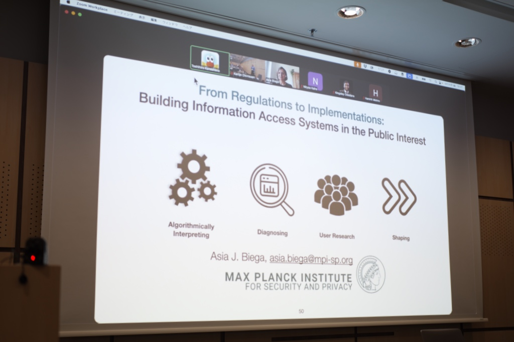
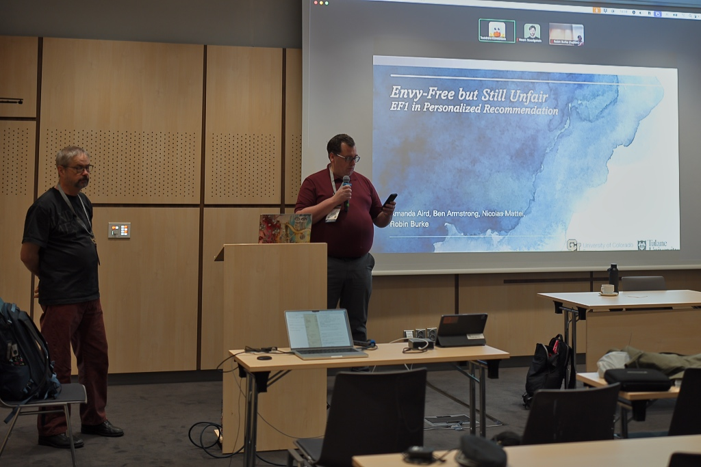

About 30 in-person and 5 on-line attendees have joined the workshop has held successfully.

Thanks for all presenters and attendees.

The summary article about the workshop is available at <a href="https://doi.org/10.1145/3705328.3748502">The ACM Ditital Library</a>

The 8th FAccTRec Workshop on Responsible Recommendation at [RecSys 2025](https://recsys.acm.org/recsys25/) is a valuable catalyst for research and community-building around fairness, accountability, transparency, and related topics in recommender systems.
In this workshop, we welcome research and position papers about ethical, social, and legal issues brought by the development and the use of recommendations that will support a discussion on providing and evaluating socially responsible recommendations.

## What's New

* 2025-09-10: [Keynote by Asia Biega]({{ "/keynote/" | relative_url }})
* 2025-08-20: [workshop schedule]({{ "/program/" | relative_url }})
* 2025-05-14: the CFP is available
* <a rel="me" href="https://recsys.social/@FAccTRec">Follow us on Mastodon</a>

## Important Dates

* 2025-07-17: Paper submission deadline is extended.
* 2025-08-13: Author notification
* 2025-08-27: Final version upload
* 2025-09-26 morning: Workshop (half day)

TIMEZONE: Anywhere On Earth (UTC-12)

<!-- ## FAccT Network

The FAccTRec 2025 workshop is proudly a part of the [FAccT network](https://facctconference.org/network/), to publish and engage with fairness, accountability, and transparency scholars across connected disciplines. -->
